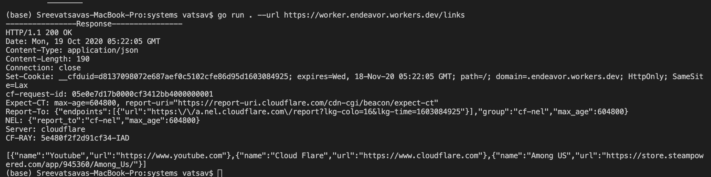
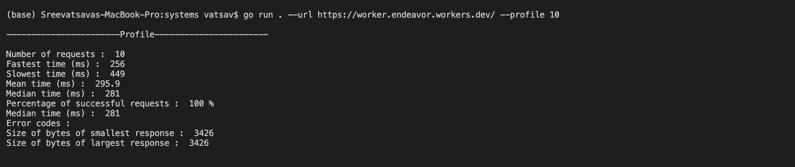
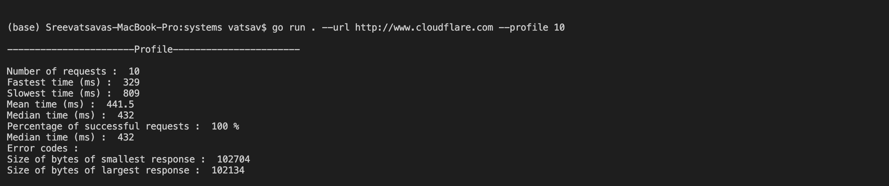
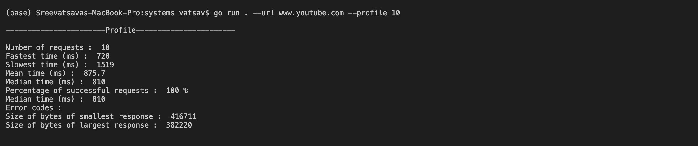
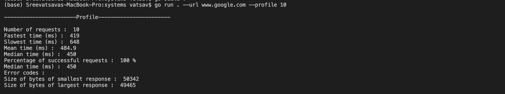
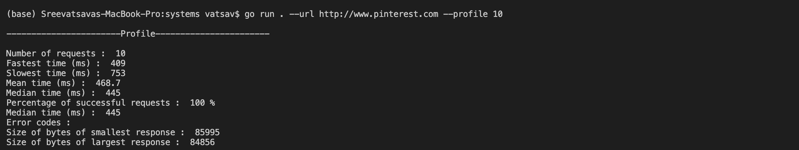

# Systems Assignment 

Language : GO

## What is it?

This exercise is a follow-on my [General Assignment](https://github.com/Sreevatsava1/cloudflare-2020-general-engineering-assignment). Created a tool that makes requests to the endpoints using TLS sockets instead of using HTTP libraries.

## Instructions to RUN the program

- Install go and setup environment to run go programs. [Official_Link] (https://golang.org/doc/install)
- Unzip the archive and move into systems folder
- To execute the program enter the command
```
go run . --url <URL>
```
- Use help command to get more details
```
go run . --help
```
- If the run command didn't work try building the program
```
go build .
```
## Results

- Youtube and Pinterest took more time compared to others as they have to load lot of image data I guess.
- Cloudflare worker loaded fastest when compared to others.

## Screenshots

1. Cloudflare worker site links

2. Cloudflare worker site

3. Cloudflare website

4. Youtube website

5. Google.com

6. Pinterest 
